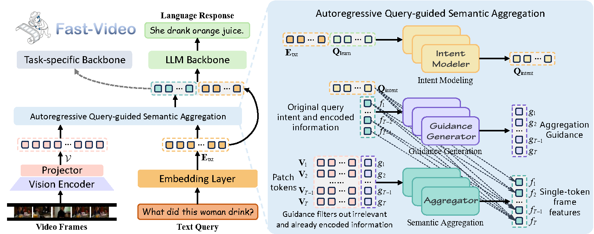
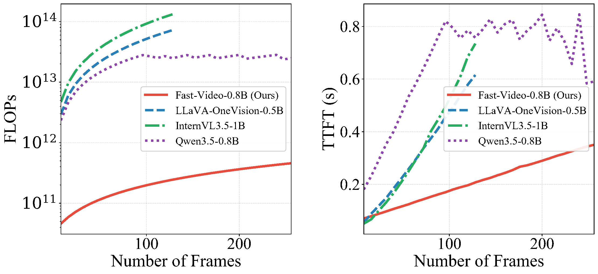
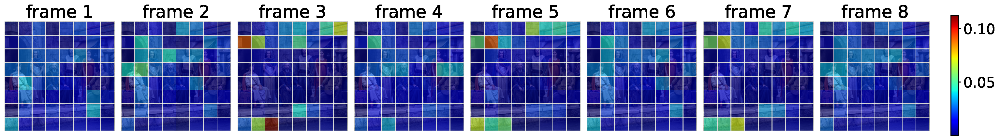
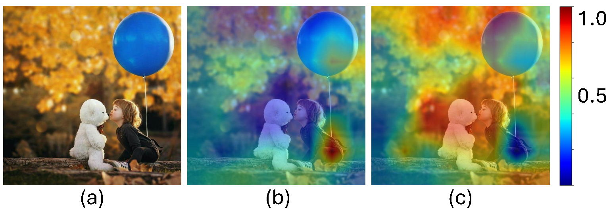

# Fast-Video: One Token to See Them All

<div align="center">

**An ultra-efficient video-language model built on Autoregressive Query-guided Semantic Aggregation (AR-QSA).**

[](LICENSE)
[](https://www.python.org/)
[](https://www.modelscope.cn/models/JRpromax/Fast-Video-f196)

</div>

---

## What is Fast-Video?

Fast-Video is a general-purpose, ultra-efficient video-language model (VLM) that compresses each video frame into a **single, highly expressive token**. Unlike dense-patch VLMs that feed hundreds of tokens per frame into the language model, Fast-Video keeps the sequence length linear in the number of frames — making long-form video understanding dramatically cheaper without sacrificing accuracy.

At the heart of Fast-Video is **AR-QSA (Autoregressive Query-guided Semantic Aggregation)**, a frame encoder that distills the dense patch features of a frame into one token, steered by the textual task query and conditioned on the tokens of previous frames.

| Video modeling paradigm | Tokens per frame | Temporal modeling | Compute |
|:---|:---|:---|:---|
| Dense patch (e.g. LLaVA-OneVision, InternVL) | Hundreds | Complex (M-RoPE, temporal cues) | Expensive |
| Plain single-token (pooling / `[CLS]`) | 1 | Simple 1D sequence | Cheap, but weak features |
| **Fast-Video (AR-QSA)** | **1** | Simple 1D sequence | **Cheap + strong features** |

---

## ✨ Highlights

- **🚀 ~100× lower FLOPs** than dense-patch VLMs of comparable scale, and **2.97× faster TTFT** than LLaVA-OneVision-0.5B at 128 frames.
- **🎯 Better accuracy, not just faster** — Fast-Video consistently outperforms the matched-data baseline LLaVA-OneVision-0.5B across five video-understanding benchmarks (EgoSchema, Video-MME, LongVideoBench, MLVU, LVBench).
- **🧩 One token per frame** — the AR-QSA encoder collapses each frame to a single token, turning video understanding into a simple 1D sequence task.
- **🔁 Autoregressive redundancy elimination** — each frame token is conditioned on the previously compressed frames, so the model only encodes *new* information and avoids wasting capacity on repeated content.
- **🎯 Query-guided aggregation** — the textual query steers which visual regions get compressed into the token, keeping only task-relevant semantics.
- **🔌 Plug-and-play feature extractor** — the non-autoregressive variant **QSA** works as a drop-in visual encoder for downstream tasks (moment retrieval, highlight detection, anomaly detection).

---

## How it works

AR-QSA consists of three small transformer modules (2 layers each) that sit between the vision encoder and the LLM:

1. **Intent Modeler** — distills the textual query into a compact set of learnable *intent* tokens that capture the task objective.
2. **Guidance Generator** (autoregressive, causal attention + KV-cache) — combines the task intent with the history of already-compressed frame tokens to produce a per-frame *guidance* vector.
3. **Compressor** (bidirectional attention) — aggregates the dense patch tokens of the current frame, steered by the guidance vector, into a single frame token.

```
Input video (T frames)
        │
        ▼
┌──────────────────────────┐
│  Vision encoder           │  FastViT-HD @ 512×512  →  64 patch tokens / frame
│  (frozen)                 │
└───────────┬──────────────┘
            │  V = {V₁ … V_T}   [B, T, 64, d]
            ▼
┌──────────────────────────┐
│  AR-QSA                   │
│  ┌──────────────────────┐ │
│  │ IntentModeler        │ │  query → intent tokens Q_intent
│  └──────────┬───────────┘ │
│             ▼             │
│  ┌──────────────────────┐ │
│  │ GuidanceGenerator    │ │  [Q_intent ; f_<t] → g_t   (causal, KV-cache)
│  └──────────┬───────────┘ │
│             ▼             │
│  ┌──────────────────────┐ │
│  │ Compressor           │ │  [V_t ; g_t] → f_t          (bidirectional)
│  └──────────┬───────────┘ │
│       loop t = 1…T  ──────┘  autoregressive: f_<t conditions f_t
└───────────┬──────────────┘
            │  F = {f₁ … f_T}   [B, T, d]  — one token per frame
            ▼
┌──────────────────────────┐
│  LLM backbone             │  Qwen3-0.6B
└──────────────────────────┘
```

<p align="center">
  
</p>

The full implementation lives in [`fast_onevision/model/multimodal_compress.py`](fast_onevision/model/multimodal_compress.py), which is extensively commented.

---

## Results

### General video understanding

All models are evaluated at 128 uniformly sampled frames on multiple-choice benchmarks (accuracy %). Fast-Video is compared against LLaVA-OneVision-0.5B, which shares the same training-data recipe and a comparable parameter count.

| Model | Params | EgoSchema | Video-MME | LongVideoBench | MLVU | LVBench |
|:---|:---:|:---:|:---:|:---:|:---:|:---:|
| LLaVA-OneVision-0.5B | 0.89B | 27.8 | 43.5 | 44.4 | 50.6 | 30.4 |
| **Fast-Video-0.8B** | **0.82B** | **30.2** (+2.4) | **45.4** (+1.9) | **45.0** (+0.6) | **52.5** (+1.9) | **32.4** (+2.0) |

Fast-Video achieves these gains while running with a fraction of the compute — see below.

### Efficiency

AR-QSA's single-token-per-frame design keeps the multimodal sequence fed to the LLM tiny, so both FLOPs and time-to-first-token (TTFT) scale far more gently with the number of frames than dense-patch baselines.

<p align="center">
  
</p>

### Qualitative visualizations

The autoregressive mechanism and query guidance can be inspected directly. On a "static video" of 8 identical frames, the guidance token's attention drifts across frames — evidence that each token captures *different* semantics rather than re-encoding the same content:

<p align="center">
  
</p>

For different queries on the same scene, the aggregator attends to different regions — the query "What color clothes is the kid wearing?" focuses on the person, while "Is the white bear real or a toy?" focuses on the toy:

<p align="center">
  
</p>

---

## QSA: a standalone visual encoder for downstream tasks

Beyond the full VLM, AR-QSA's aggregation is highly transferable. A lightweight **non-autoregressive variant, QSA**, distills each frame into a single query-aware token and can be dropped into existing single-token-per-frame frameworks as a feature extractor.

Integrating QSA features into **LD-DETR** and **DSANet** sets new state-of-the-art results on three widely used benchmarks.

**Moment Retrieval & Highlight Detection — QVHighlights**

| Method | R1@0.5 | R1@0.7 | mAP (HD) | HIT@1 |
|:---|:---:|:---:|:---:|:---:|
| LD-DETR | 66.80 | 51.04 | 40.51 | 65.11 |
| **LD-DETR + QSA** | **74.13** | **59.10** | **43.91** | **72.19** |

**Moment Retrieval — Charades-STA**

| Method | R@0.5 | R@0.7 | mIoU |
|:---|:---:|:---:|:---:|
| LD-DETR | 62.58 | 41.56 | 53.44 |
| **LD-DETR + QSA** | **71.56** | **51.18** | **60.41** |

**Weakly Supervised Video Anomaly Detection — XD-Violence**

| Method | mAP@0.1 | mAP@0.3 | mAP@0.5 | Avg. |
|:---|:---:|:---:|:---:|:---:|
| DSANet | 43.53 | 31.35 | 19.80 | 31.38 |
| **DSANet + QSA** | **46.00** | **33.91** | **20.52** | **33.43** |

See [Downstream task usage](#downstream-task-usage) for the feature-extraction scripts.

---

## Model Zoo

| Model | Params | Link | Notes |
|:---|:---:|:---|:---|
| **Fast-Video-f196** | ~0.8B | [ModelScope](https://www.modelscope.cn/models/JRpromax/Fast-Video-f196) | Full VLM checkpoint (Qwen3-0.6B + FastViT-HD + AR-QSA), trained up to 196 frames |

> The same checkpoint is used for both VLM inference and QSA downstream feature extraction.

---

## Installation

A one-command setup script installs `fast_onevision` with all dependencies and verifies the environment:

```bash
bash setup_env.sh
```

**Requirements**
- Python ≥ 3.10
- CUDA 12+ GPU (≥ 24 GB memory recommended; training uses 4× NVIDIA RTX 5880 Ada)

---

## Quick start: inference

Download the checkpoint from [ModelScope](https://www.modelscope.cn/models/JRpromax/Fast-Video-f196), then run the demo:

```bash
python fast_onevision/eval/demo.py \
    --model_path /path/to/Fast-Video-f196 \
    --prompt_json fast_onevision/eval/prompt.json \
    --device cuda:0
```

Or load the model programmatically:

```python
import torch
from transformers import AutoTokenizer
from fast_onevision.model import FastOneVisionForCausalLM

model = FastOneVisionForCausalLM.from_pretrained(
    "/path/to/Fast-Video-f196",
    aux_init_path="/path/to/Fast-Video-f196",
    dtype=torch.bfloat16,
    attn_implementation="flash_attention_2",
    device_map="cuda:0",
    trust_remote_code=True,
).eval()

tokenizer = AutoTokenizer.from_pretrained(
    "/path/to/Fast-Video-f196", use_fast=False, trust_remote_code=True
)

image_processor = model.get_vision_tower().image_processor
```

The demo supports single images (`demo.jpg`) and videos (`demo.avi`); see [`fast_onevision/eval/demo.py`](fast_onevision/eval/demo.py) for the full pipeline.

---

## Benchmark evaluation

### General video understanding

```bash
# Single-GPU evaluation (native HF inference)
python model_test/model_test_fast_video.py \
    --model-path /path/to/Fast-Video-f196 \
    --num-frames 128 \
    --num-samples 0 \
    --benchmarks videomme mlvu longvideobench lvbench egoschema

# Multi-GPU parallel orchestration
python model_test/run_parallel_fast_video.py --full --gpus 0,1,2,3,4,5,6,7
```

Results are saved as JSON summaries under `fast_video_results/`. Use [`model_test/examier.py`](model_test/examier.py) to compute accuracy from the model outputs.

### Efficiency benchmarks

```bash
python model_test/delay_memory_test_fast_video.py   # Fast-Video memory & latency
python model_test/delay_memory_test.py              # baseline memory & latency
python model_test/FLOP_test.py                      # FLOPs measurement
```

---

## Training

Fast-Video follows a four-stage curriculum that gradually transitions the model from dense-patch processing to the single-token-per-frame pipeline. All launch scripts are under [`scripts/train/`](scripts/train/), and the data paths should be updated to your local copies (we follow the LLaVA-OneVision data recipe).

| Stage | Data | Optimized modules | LR |
|:---|:---|:---|:---|
| 1 — Modality alignment | 558K image-caption pairs | Vision projector | 1e-3 |
| 2a — Structural adaptation (warm-up) | 558K image-caption pairs | Vision projector + AR-QSA | 1e-4 / 1e-3 (query) |
| 2b — Structural adaptation (full FT) | 4M image V-L pairs | Full parameters | 2e-6 (vision) / 1e-5 (others) |
| 3 — Dynamic temporal pre-training | 3.2M image instruction data | Full parameters | 2e-6 (vision) / 1e-5 (others) |
| 4 — Joint video-image instruction tuning | 1.6M video + image data | Full parameters | 2e-6 (vision) / 1e-5 (others) |

**Stage 1 — Modality alignment.** Train only the vision-language projector to align visual and text spaces; AR-QSA is bypassed.

```bash
bash scripts/train/pretrain_projector.sh
```

**Stage 2 — Structural adaptation.** Activate AR-QSA and switch from dense patches to one token per frame. "Static videos" are synthesized by 16-fold image replication. Run the warm-up epoch, then full fine-tuning:

```bash
bash scripts/train/pretrain_compresssor.sh   # epoch 1 — compressor pre-training
bash scripts/train/mid_stage.sh              # epoch 2 — full fine-tuning
```

**Stage 3 — Dynamic temporal pre-training.** Stochastically expand single images into 1–16 frame sequences so the model learns to distinguish static from dynamic scenes.

```bash
bash scripts/train/si_stage.sh
```

**Stage 4 — Joint video-image instruction tuning.** Final end-to-end training on mixed video (8–196 frames) and image (1–16 frames) data.

```bash
bash scripts/train/ov_stage.sh
```

All stages use the AdamW optimizer with cosine LR decay, a warm-up ratio of 0.03, a global batch size of 512, and DeepSpeed ZeRO-2. The full pipeline takes about a week on 4× NVIDIA RTX 5880 Ada GPUs.

---

## Downstream task usage

Extract QSA features for moment retrieval, highlight detection, and anomaly detection:

```bash
# QVHighlights (moment retrieval + highlight detection)
python scripts/feature_extraction/gen_feat_for_qvhl.py \
    --model_path /path/to/Fast-Video-f196 \
    --query_path /path/to/moment_detr/data \
    --video_path /path/to/qvhl/videos \
    --save_path /path/to/features

# Charades-STA (moment retrieval)
python scripts/feature_extraction/gen_feat_for_charades.py \
    --model_path /path/to/Fast-Video-f196 \
    --query_path /path/to/charades \
    --video_path /path/to/charades/Charades_v1 \
    --save_path /path/to/charades/custom_features

# XD-Violence (weakly supervised video anomaly detection)
python scripts/feature_extraction/gen_feat_for_xdviolence.py
```

Each script writes per-frame compressed features (one token per frame) plus text features, ready to be consumed by the corresponding downstream framework (e.g. LD-DETR for MR/HD, DSANet for WS-VAD).

---

## Project structure

```
Fast-Video-main/
├── README.md
├── setup_env.sh                           # one-command environment setup
├── figures/                               # figures used in this README
├── fast_onevision/
│   ├── model/
│   │   ├── multimodal_compress.py         # ★ AR-QSA: IntentModeler + GuidanceGenerator + Compressor
│   │   ├── fast_onevision_arch.py         # FastOneVisionForCausalLM top-level model
│   │   ├── fast_vit_arch.py               # FastViT-HD vision encoder
│   │   ├── builder.py                     # model loading & initialization
│   │   ├── multimodal_encoder/            # vision encoder backends (CLIP, MobileCLIP)
│   │   ├── multimodal_projector/          # linear vision-language projector
│   │   └── language_model/                # LLM backbone wrapper
│   ├── train/
│   │   ├── train.py                       # training entry point
│   │   └── llava_trainer.py               # custom HF Trainer
│   ├── eval/
│   │   ├── demo.py                        # interactive inference demo
│   │   └── prompt.json                    # demo prompts
│   ├── constants.py                       # special token IDs and model constants
│   └── utils.py                           # data processing / weight init / masking
├── scripts/
│   ├── train/                             # per-stage training launch scripts
│   ├── feature_extraction/                # downstream QSA feature extraction
│   │   ├── gen_feat_for_qvhl.py
│   │   ├── gen_feat_for_charades.py
│   │   └── gen_feat_for_xdviolence.py
│   ├── demo.sh                            # demo launcher
│   ├── zero2.json                         # DeepSpeed ZeRO-2 config
│   └── zero2_video.json                   # DeepSpeed ZeRO-2 config (video)
└── model_test/                            # evaluation & benchmarking scripts
    ├── model_test_fast_video.py           # Fast-Video batch evaluation (native HF)
    ├── run_parallel_fast_video.py         # multi-GPU orchestration
    ├── delay_memory_test*.py              # memory & latency benchmarks
    ├── FLOP_test.py                       # FLOPs measurement
    ├── examier.py                         # answer scoring
    └── abstract_test_class.py             # dataset base classes
```

---

## License

This project is released under the [Apache 2.0 License](LICENSE).
